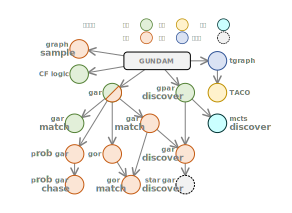

# **G**raph **U**nifined **N**on-overhead **D**istributed **A**daptive **M**odel


## Type

### GraphType

Interface of all graph types see [here](/doc/接口统计_分类.pdf).

#

#### SmallGraph

* Does not support index.
* Does not support attribute on vertex.
* Does not support attribute on edge.

[head file](/include/gundam/graph_type/small_graph.h): 
```
/include/gundam/graph_type/small_graph.h
```
#
```c++
template <class VertexIDType, class VertexLabelType, 
          class   EdgeIDType, class   EdgeLabelType>
class SmallGraph;
```
#
Explanation

Light-weight graph type for small graph to save memory, does not support index. Neither support attribute on vertex nor edge.

#

#### LargeGraph

* Support index.
* Support attribute on vertex.
* Support attribute on edge.

[head file](/include/gundam/graph_type/large_graph.h): 
```
/include/gundam/graph_type/large_graph.h
```
#
```c++
template <class VertexIDType, class VertexLabelType, class VertexAttributeKeyType, 
          class   EdgeIDType, class   EdgeLabelType, class   EdgeAttributeKeyType>
class LargeGraph;
```

#
Explanation

Heavy-weight graph type for large graph for efficiency. Support index and also support attribute on both vertex and edge.

Use map/set (red-black tree) as low level container, fast to load graph no matter how the vertex/edge are sorted in CSV file but can cause performance problems since it is not cache-friendly.

#

#### LargeGraph2

* Support index.
* Support attribute on vertex.
* Support attribute on edge.

[head file](/include/gundam/graph_type/large_graph2.h): 
```
/include/gundam/graph_type/large_graph2.h
```
#
```c++
template <class VertexIDType, class VertexLabelType, class VertexAttributeKeyType, 
          class   EdgeIDType, class   EdgeLabelType, class   EdgeAttributeKeyType>
class LargeGraph2;
```

#
Explanation

Heavy-weight graph type for large graph for efficiency. Support index and also support attribute on both vertex and edge.

The only difference compare to LargeGraph is this data type use vector as low level container, which makes it more cache-friendly and brings higher performance. However, the time complexity for loading graph can become O(N2) when the vertex/edge are not stored properly in the CSV file.

#

#### Graph

* Support index.
* Support attribute on vertex, separated or grouped.
* Support attribute on edge, separated or grouped.

[head file](/include/gundam/graph_type/graph.h): 
```
/include/gundam/graph_type/graph.h
```
#
```c++
template <typename... configures>
class Graph;
```

#

### Vertex
#### VertexHandle
```c++
using VertexHandleType = typename GUNDAM::VertexHandle<GraphType>::type
```
#### VertexID
```c++
using VertexIDType = typename GUNDAM::VertexID<GraphType>::type
```
#### VertexLabel
```c++
using VertexLabelType = typename GUNDAM::VertexLabel<GraphType>::type
```
#### VertexAttributeHandle
```c++
using VertexAttributeHandleType = typename GUNDAM::VertexAttributeHandle<GraphType>::type
```

#

### Edge
#### EdgeHandle 
```c++
using EdgeHandleType = typename GUNDAM::EdgeHandle<GraphType>::type
```
#### EdgeID
```c++
using EdgeIDType = typename GUNDAM::EdgeID<GraphType>::type
```
#### EdgeLabel
```c++
using EdgeLabelType = typename GUNDAM::EdgeLabel<GraphType>::type
```
#### EdgeAttributeHandle
```c++
using EdgeAttributeHandleType = typename GUNDAM::EdgeAttributeHandle<GraphType>::type
```

## Interface
Graph

## match

[Match](/doc/prog_doc/match.md)

## algorithem

VF2

Dpiso

Bfs

Dfs

## tools

[tools](/doc/prog_doc/tools.md)

## works with publication
